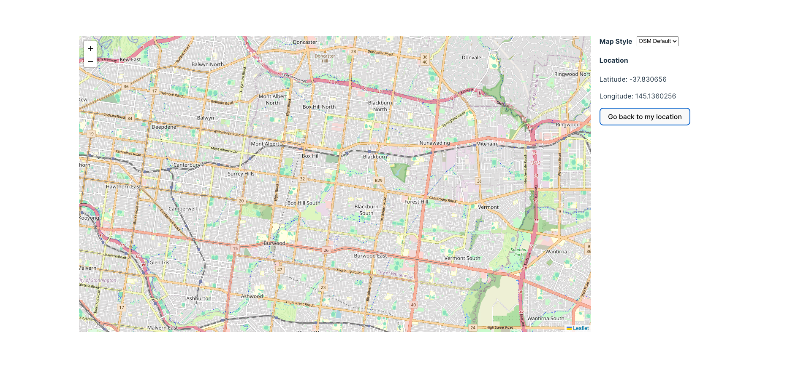
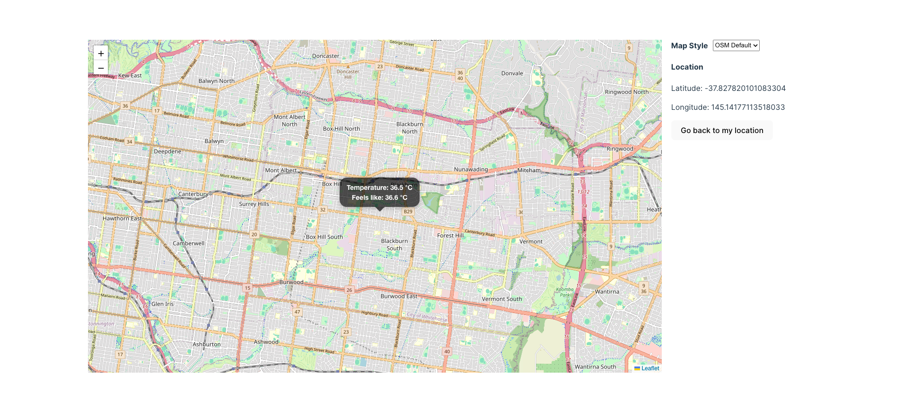

TempMap
=======
This is a simple web application that allows to get current temperature on a map by a single click.
The application is built in Vite/React framework and the OpenWeatherMap API.
Map styles are changed by the user's choice.

### Try it out by:
1. Cloning the repository
2. Running `npm install`
3. Running `npm run dev`
4. Opening `http://localhost:5173` in your browser

### Screenshots: 

